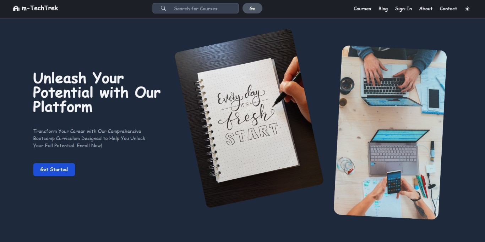

# m-techtrek

E-Learning Platform built using Next.js, Node.js, and Tailwind

## 👉 [Live ](https://m-techtrek.vercel.app/)

m-techtrek is an online bootcamp website that provides aspiring tech professionals with an immersive learning experience in various areas of technology such as web development, mobile developement, and UI/UX Design. The platform aims to equip its students with the knowledge, skills, and confidence they need to launch their tech careers successfully.

## Preview

